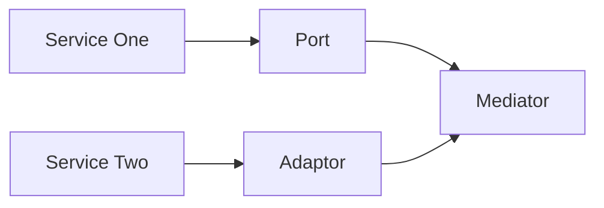

# API-Translater:

This is a clean room version of a service I have seen needed.


## Intentions:


## Design:
  1. There is a core class, which is in essence, a mediator between two differnt handler classes.
  2. If you were to think of two different APIs on the 'left' and 'right' of the 'mediator', the left hand side is an 'adaptor' and the right hand side is a 'port'.
  3. For each of the ports or adaptors created, there is a common signature which allows each to be interchangable.
  4. Bidirectional communication might be needed at any point.
  5. Routes in a REST API can serve to talk to only the specific parts we need.

## Motivations:
  1. There comes a time in every engineer's life where you have to weld in a bad hack between two services which don't talk to each other.


## Visuals:

#### Scenario 1

Under 'Scenario 1', we have the ability to have bidirectional communication, without either side knowning about the other.
As a result, the mediator handles some basic logic and the implementations for either the 'port' or 'adaptor' are unique.
These 'plug in' to the mediator, which can be instantiated as either a REST route or something else.


#### Scenario 2
```mermaid
flowchart LR


```
Under 'Scenario 2', we would run into a problem, where we have to create a brand new implementation every time a new port or adaptor appeared.
Any time a new port or adaptor appears, you might have to re-create every single use case for both sides of the equation.
The 'mediator' in the middle, gives us a standard set of commands to call and is the only thing you really need to interface with.

## Notes and Discussion:
  1. 


## References:
  1. 