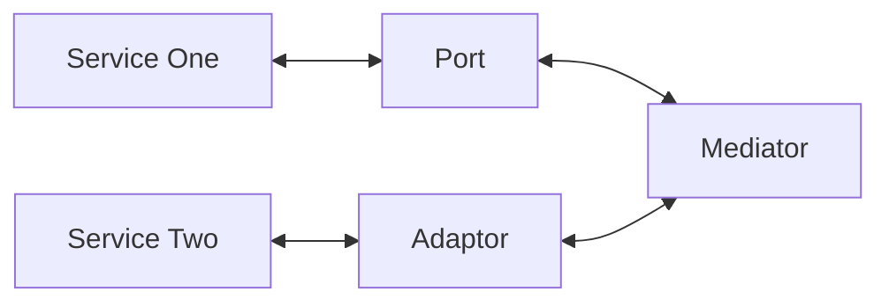
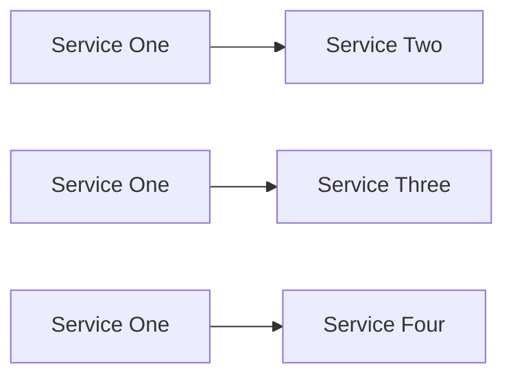
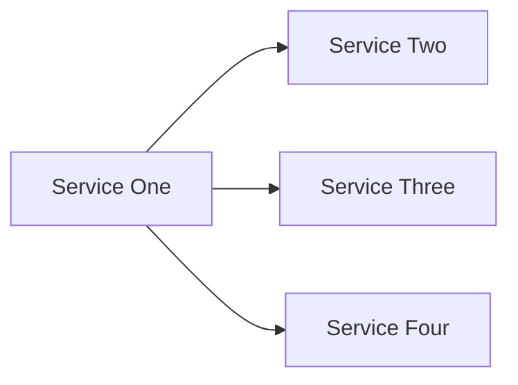
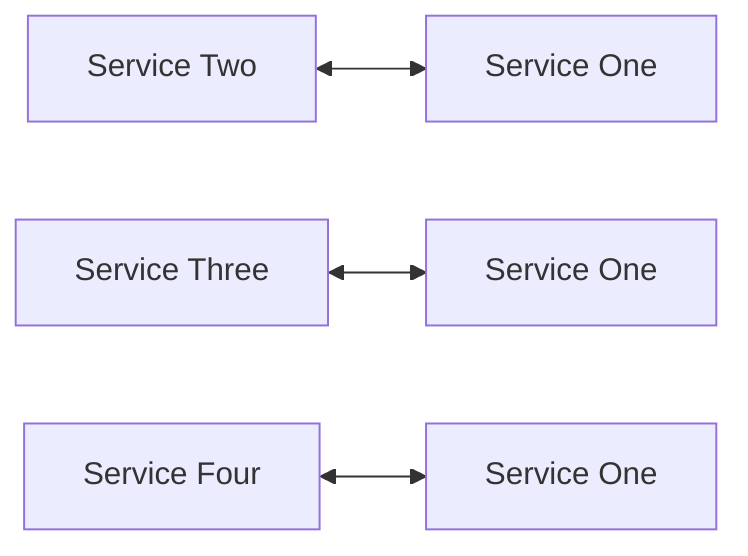

# API-Translater:

A simple pattern and library to allow for two APIs to speak to one another through a mediator design.

## Intentions and Proposal:
  1. I want to build a simple pattern, which allows for communication between two (2) different API services.
  2. I would like that pattern to isolate the amount of changes needed to only a specific implementation to an API.
  3. I would like to keep the jobs to be done for the core service as small as possible.
  4. Communications are handled at the payload level and while each service can communicate to it's own class however it wants, it must select a uniform format to reply to the mediator with, for optimal reuse.

## Design:
  1. There is a core class, which is in essence, a mediator between two differnt handler classes.
  2. If you were to think of two different APIs on the 'left' and 'right' of the 'mediator', the left hand side is an 'adaptor' and the right hand side is a 'port'.
  3. For each of the ports or adaptors created, there is a common signature which allows each to be interchangable.
  4. Bidirectional communication might be needed at any point.
  5. Routes in a REST API can serve to talk to only the specific parts we need.

## Motivations:
  1. There comes a time in every engineer's life where you have to weld in a bad hack between two services which don't talk to each other.
  2. This might be in transforming user account formats or allowing for updates where you cannot use a queue.

## Visuals:

#### Scenario 1

Under 'Scenario 1', under our deisgn, we have the ability to have bidirectional communication, without either side knowning about the other.
As a result, the mediator handles some basic logic and the implementations for either the 'port' or 'adaptor' are unique.
These 'plug in' to the mediator, which can be instantiated as either a REST route or something else.

You could choose to make each class a very specific use case and spawn another mediator, or create full feature classes. 

Under 'Scenario 2', we would run into a problem, where we have to create a brand new implementation every time a new port or adaptor appeared.
Any time a new port or adaptor appears, you might have to re-create every single use case for both sides of the equation.
The 'mediator' in the middle, gives us a standard set of commands to call and is the only thing you really need to interface with.

#### Scenario 2

Under 'Scenario 3', you may be able to get a single class to add functionality to each service but this could get complex.

#### Scenario 3

Under 'Scenario 4', we might consider making bidirectional communications, which mean we could bump into a new implementation for each service:

#### Scenario 4

## Notes and Discussion:
  1. Each scenario might have legitimate usecases for one-off integrations. However, one-off is seldom one-off for long.
  2. The ports and adaptors folders would eventually build up such that any port and any adaptor should work with one another.
  3. The 'interface' to the mediator itself could be anything but REST routes seem most common at the time of this drafting.
  4. You may find your ability to consistantly send the meditor a standardized data model reduces the total number of classes needed.

## References:
  1. 